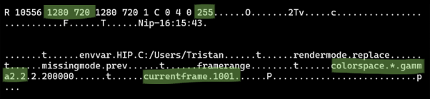

## // Adaptive Fluid Solver (VEX)

<figure>
<video loop autoplay>
    <source src="assets/fluidamr_grid.mp4" type="video/mp4">
</video>
<figcaption>The cells of the adpative grid</figcaption>
</figure>
<figure>
<video loop autoplay>
    <source src="assets/fluidamr_color.mp4" type="video/mp4">
</video>
<figcaption>Visualisation of the computed velocity field</figcaption>
</figure>

The goal of this personal project was to create a 2D fluid solver from scratch in Houdini's geometry processing language [VEX](https://www.sidefx.com/docs/houdini/vex/index.html) and implement an adaptive grid rather than the standard dense or sparse grid solvers provided natively in Houdini. It was inspired by a [SpaceX talk](https://www.youtube.com/watch?v=vYA0f6R5KAI) I came across by chance as I was getting deeper into Houdini at work (visual effects for movies) and replicating their approach seemed like a good way to get more familiar with VEX and simulation in general. Fluid solvers are implemented by solving the [Navier-Stokes Equations](https://www.youtube.com/watch?v=ERBVFcutl3M) on a grid of cells and are used not just for liquids but also smoke, fire and most importantly for movies, explosions. The canonical book [Fluid Simulation for Computer Graphics](https://www.oreilly.com/library/view/fluid-simulation-for/9781482232844/) was my main reference for the fundamental algorithm.

A solver which uses the most basic approach of a **dense grid** simply divides the 3D space up evenly and the computation is run on each cell for each timestep. A **sparse grid**, which Houdini added support for in late 2019, adds the ability for cells to be in a deactivated state allowing the computation on these cells to be skipped for some performance improvements. The benefit of an **adaptive grid** is that the size of the cells no longer has to be uniformly constant and can vary across the domain so we can have more cells where there's a lot of variation in velocity and fewer cells where the motion changes smoothly. You could certainly go further and combine the idea of sparse grids with adaptive grids although I suspect once you have an adaptive grid there would be litte further gain by also accommodating sparsity.

In the SpaceX talk they discuss how using a form of [wavelet compression](https://en.wikipedia.org/wiki/Wavelet_transform#Wavelet_compression) (not as complicated as Wikipedia makes it out to be) to create the adaptive grid allows them to keep the memory usage of the massive simulations needed for rocket development low enough that they can run the computation on GPUs for a big speed boost.

Adaptive grids are far from a new idea and are commonly used in scientific simulations where it's referred to as [Adaptive Mesh Refinement (AMR)](https://en.wikipedia.org/wiki/Adaptive_mesh_refinement), but the concept hasn't yet been widely adopted in computer graphics. 

On the face of it using adaptive grids for simulations could be even more beneficial in movie VFX since we only care about how the simulation looks from the point of view of the camera so we could not only vary the cell size based on the velocity field but also based on the distance from camera, allowing more detail close to camera where we can see it and letting the resolution reduce as it gets further away.

The visualisations from my VEX implementation above show the simulation grid itself on the left and the velocity field on the right. The number of grid cells in this example simulation that need to be computed and stored in memory at each time step is about 5x fewer than would be required with a dense grid approach.

 
## // CUDA Raymarching (C++ | CUDA | OpenGL)

<video loop autoplay>
    <source src="assets/CUDA_raymarching.mp4" type="video/mp4">
</video>

This project was mostly just an excuse to experiment with programming the GPU directly with CUDA. The idea was to create a GPU renderer which has simple and fast geometry intersections to allow for shooting enough rays to get complex lighting at interactive frame rates. 

Specifically, the geometry intersection routine is raymarching through axis aligned bounding boxes and the lighting supports multiple bounces of indirect illumination and area lights.

In the example above there are 4 indirect bounces and it's shooting 32 rays per pixel which runs at around 70fps on my RTX 3060 GPU.

The [code](https://github.com/tristan-north/cubeworld) is up on my github with most of the juice being in [kernel.cu](https://github.com/tristan-north/cubeworld/blob/master/kernel.cu). The main references I used were [this project](https://github.com/straaljager/GPU-path-tracing-with-CUDA-tutorial-2) and the eternally useful [scratchapixel](https://scratchapixel.com/lessons/3d-basic-rendering/introduction-acceleration-structure/bounding-volume-hierarchy-BVH-part1.html).

 
## // Raytracer (C++)

<video loop autoplay>
    <source src="assets/raytracer.mp4" type="video/mp4">
</video>

This renderer is a software renderer written in C++ and is a bit more fully featured than the CUDA raymarcher. It supports different types of materials, loading arbitrary geometry and tracing against triangles using an acceleration structure for faster performance.

It's primarily based on the book [Raytracing from the Ground Up](https://www.amazon.com/Ray-Tracing-Ground-Kevin-Suffern-ebook/dp/B00SC81178) using the acceleration structure as described on [scratchapixel.com](https://www.scratchapixel.com/lessons/3d-basic-rendering/introduction-acceleration-structure/grid.html).

The geometry is loaded using a custom [obj file format](https://en.wikipedia.org/wiki/Wavefront_.obj_file) parser.

Having used renderers for years at work it was very rewarding to create my own and understand how they work at the deepest level. There's nothing like having to do it yourself to appreciate the nuance and tradeoffs that have to be made.

The [code](https://github.com/tristan-north/raytracer) is up on my github.

 
## // Fplay (C++ | Qt)

<figure>
<video loop autoplay>
    <source src="assets/fplay.mp4" type="video/mp4">
</video>
<figcaption>The fplay interface playing an example simulation.</figcaption>
</figure>

Fplay is a drop in replacement for Mplay which is a utility program shipped with Houdini. When creating simulations, which can take some time to calculate, Houdini captures the viewport at each frame and sends it to Mplay to be able to play back in realtime. Unfortunately the Mplay interface is a bit terrible and has some unhelpful quirks such as overwriting the frames of the previous sim by default.

Initially it wasn't at all clear how Mplay could be replaced as Houdini does some behind the scenes magic to open Mplay automatically and send it the captured frames.

This is all undocumented so it took some poking around with [wireshark](https://www.wireshark.org) but it turns out Houdini is sending the frames to Mplay over TCP and by placing a file named .flipbook_lock.$HOSTNAME in the user dir which contains a port number, we can intercept the communication by starting our own TCP server to listen on that port.

The data sent for each frame contains two header packets with some basic information useful for interpreting the actual image data such as the resolution, pixel format, colorspace and frame number. If we interpret the packet data as ASCII we get:

The fplay interface shows the list of previous sequences on the left with standard playback controls and a button for saving out the image sequence to a .mov file for easy sharing.

The [code](https://github.com/tristan-north/fplay) is up on my github.

 
## // 3D Painting (C++ | OpenGL | Qt)

<figure>
<video loop autoplay>
    <source src="assets/3dpaint.mp4" type="video/mp4">
</video>
<figcaption>The 3D Paint OpenGL view and corresponding texture map being generated on the fly.</figcaption>
</figure>

This is a prototype 3D paint program which allows you to load a model and paint on the surface. It generates a 2D texture of the paint based on the UV coordinates of the geometry vertices. This texture can then be used by a renderer like Pixar's Renderman.

There was a focus on the speed of the 2D texture creation from the 3D paint since the ultimate goal of the project was to be able to paint interactively while the texture is being generated on the fly in the background and updated live in the renderer.

To achieve this the texture generation is performed on the GPU and the resulting pixels written to a TIF image using custom code specific to this project, rather than relying on a generic image library. The result is a 2048x2048 texture can be generated and written to disk as a TIF image in less than 100ms.

The [code](https://github.com/tristan-north/looklab) is up on my github.

 
## // Additional Projects
 - Gleam Maya 8.5 (screenshot)
 - fmon
 - renderLog (screenshot from old reel)
 - rmanView, a framebuffer for renderman (code on github)
 - VR cinema app
